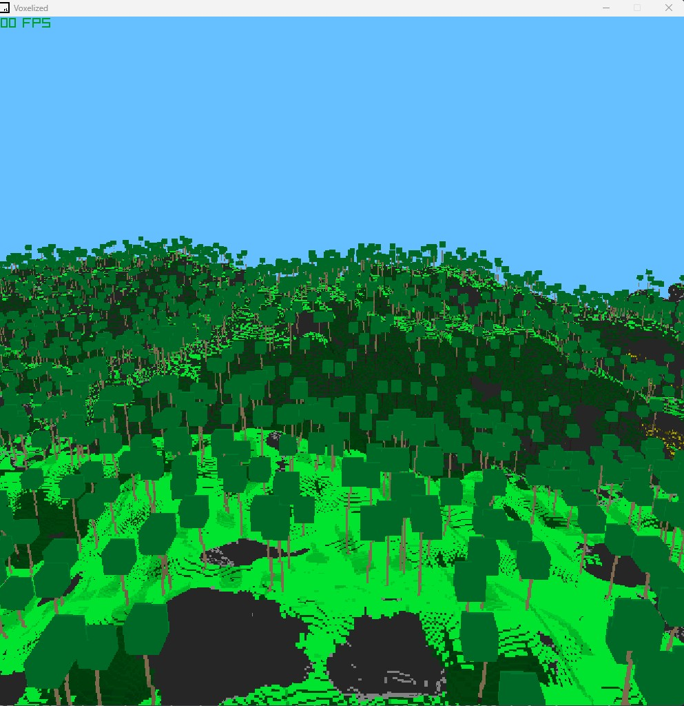

This is an implementantion of a cpu raytracer.
It's meant to run in real time, and is developed on a ryzen 5950x, it currently doesn't have completely implemented avx2 instructions for simding ray traversal.

IT REQUIRES AVX2 INSTRUCTIONS TO BE SUPPORTED BY YOUR CPU OR OTHERWISE IT WILL CRASH (If you are a judge reading this, your windows VM might not have avx2 enabled)

Technical details are blogged on my personal site:
https://nixuntris.github.io/Private-Website/blueprint.html?id=raytracer

The project has raylib linked to where it's installed by the raylib installer, if you have it installed somewhere else you need to change the COMPILER_PATH variable in the Makefile to where it's saved.
I have not tested it on linux, this was developed on windows, so there maybe unexpected issues there.
This is also setup to be plug and play with visual studio code. If you wish to use another IDE/code editor you may need to do some edits.
You're allowed to do with this project as you please, just credit where you got this code from or based it on.

(This setup is based of educ8s Raylib-CPP Starter Template for VS Code)

Controls are:
W - forward
S - backwards
Mouse - rotation